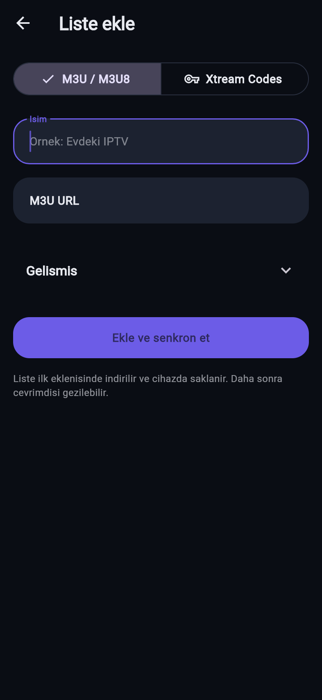
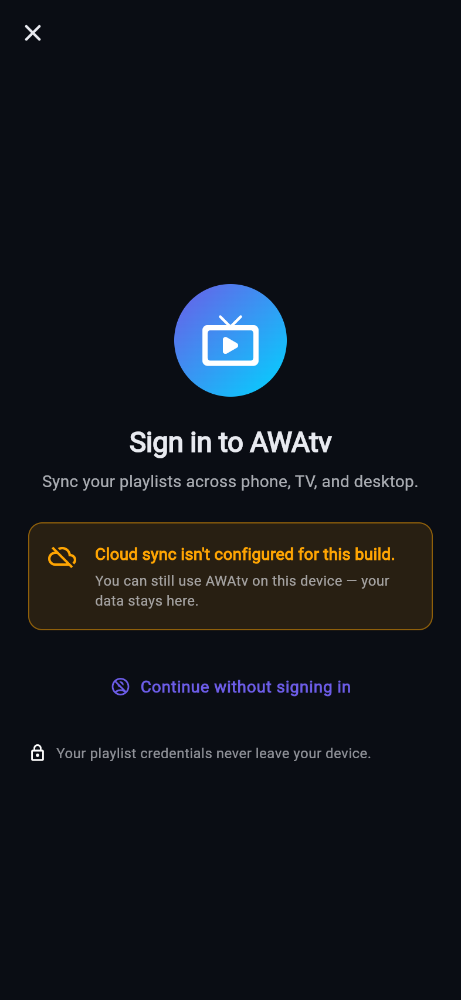

# AWAtv

Cross-platform freemium IPTV / streaming application.

**Targets:** iOS, Android, Apple TV, Android TV, macOS, Windows, Web (via Flutter).

**Status:** Phase 0 + Phase 1 in progress (mobile MVP).

## Screenshots

Captured against the live deployment at <https://awatv.pages.dev>.

| Onboarding | Add Playlist (Xtream) | Sign-in |
|---|---|---|
|  |  |  |

See [`store/screenshots/INDEX.md`](store/screenshots/INDEX.md) for the
full set (16 PNGs across 8 screens × mobile + desktop) and the
regeneration script at [`scripts/capture-screenshots.sh`](scripts/capture-screenshots.sh).

## Quick start

```bash
# Prereqs:
#   - Flutter 3.27+ (brew install --cask flutter)
#   - Xcode (for iOS) — sudo xcode-select -s /Applications/Xcode.app/Contents/Developer
#   - Android Studio or Android SDK

cd AWAtv
flutter pub get                        # resolves all workspace packages

# Mobile app
cd apps/mobile
cp .env.example .env                   # add TMDB_API_KEY here
flutter run                            # iOS Simulator / Android Emulator / device
```

## Repository layout

See [`CLAUDE.md`](CLAUDE.md) for full architecture and decisions.
See [`AGENT.md`](AGENT.md) for module-ownership rules used by parallel agents.
See [`docs/DESIGN.md`](docs/DESIGN.md) for the design specification.
See [`docs/ROADMAP.md`](docs/ROADMAP.md) for the phased delivery plan.

## License

Private — proprietary. All rights reserved.
